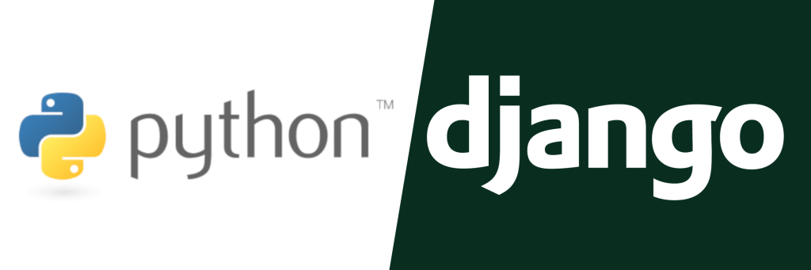

# Django Tutorials <!-- omit in toc -->



A collection of tutorials and resources I found useful for Django.

## Table of Contents <!-- omit in toc -->

- [Repository Details](#repository-details)
  - [Official Tutorials](#official-tutorials)
- [Links](#links)
- [Ref](#ref)
  - [Project directory structure](#project-directory-structure)
  - [Creating a Django site/project](#creating-a-django-siteproject)
  - [Creating a Django app](#creating-a-django-app)
  - [Creating a Django admin/"superuser"](#creating-a-django-adminsuperuser)
  - [Creating a Django CSRF secret key](#creating-a-django-csrf-secret-key)
  - [Run the server](#run-the-server)
    - [Development server](#development-server)

## Repository Details

### Official Tutorials

The [official tutorials](./official_tutorials/) section includes tutorials/references from the [Django documentation site](https://docs.djangoproject.com/en/5.1/).

This includes the [Django "Polls" tutorial](./official_tutorials/django-polls-app/), which was created using the [Django 5.1 docs' Polls app tutorial](https://docs.djangoproject.com/en/5.1/intro/tutorial01/#creating-the-polls-app)

## Links

- [Django homepage](https://docs.djangoproject.com/)
- [Github: Django repository home](https://github.com/django/django)
  - [Github: Django admin `base_site.html`](https://github.com/django/django/blob/main/django/contrib/admin/templates/admin/base_site.html)
    - For customizing Django's `/admin` site's base template, including changing the "branding" for the page, and its color scheme
  - [Github: Django admin `index.html`]()
    - For customizing Django's `/admin` homepage
- [Docs: Django project docs](https://docs.djangoproject.com/en/5.1/)
  - [Docs: Django intro tutorial](https://docs.djangoproject.com/en/5.1/intro/)
  - [Docs: Django topics](https://docs.djangoproject.com/en/5.1/topics/)
  - [Docs: Django API reference](https://docs.djangoproject.com/en/5.1/ref/)
  - [Docs: "How-to" guides](https://docs.djangoproject.com/en/5.1/howto/)
    - [Docs: How to create database migrations](https://docs.djangoproject.com/en/5.1/howto/writing-migrations/)
    - [Docs: How to manage static files](https://docs.djangoproject.com/en/5.1/howto/static-files/)
      - [Docs: How to deploy static files in production](https://docs.djangoproject.com/en/5.1/howto/static-files/deployment/)
    - [Docs: How to configure & use logging](https://docs.djangoproject.com/en/5.1/howto/logging/)
    - [Docs: How to pre-populate app database with fixtures](https://docs.djangoproject.com/en/5.1/howto/initial-data/)
    - [Docs: How to use Django's CSRF protection](https://docs.djangoproject.com/en/5.1/howto/csrf/)
    - [Docs: How to deploy Django](https://docs.djangoproject.com/en/5.1/howto/deployment/)
    - [Docs: How to override templates](https://docs.djangoproject.com/en/5.1/howto/overriding-templates/)
      - [Docs: How to override templates with `APP_DIRS`](https://docs.djangoproject.com/en/5.1/howto/overriding-templates/#overriding-from-an-app-s-template-directory)
- Django Admin site debug toolbar
  - [Github: `django-debug-toolbar` Github](https://github.com/jazzband/django-debug-toolbar)
  - [Blog: How to set up `django-debug-toolbar`](https://dev.to/sm0ke/django-debug-toolbar-how-to-configure-2ap9)
  - [Docs: `django-debug-toolbar`](https://django-debug-toolbar.readthedocs.io/en/latest/installation.html)
- [Blog: Securing Django best practices](https://medium.com/django-unleashed/securing-django-applications-best-practices-for-managing-secret-keys-and-environment-variables-f10f5a53490b)


## Ref

### Project directory structure

(assumes root is the current directory, where a `.venv` and/or `requirements.txt`/`pyproject.toml` file are, i.e. `./`)

Your Django project's root is wherever the `manage.py` file is. A good project structure is `./some-project-name-it-doesn't-matter/{django_project_name}`. The name of the directory your Django project exists in (one directory below the `manage.py` file) can be anything you want, as it is just a filesystem path. You can initialize a Django project right at the project root, so your `manage.py` is at the repository's root path. This way, you do not need to change directory into your Django project before running `manage.py` commands.

### Creating a Django site/project

Use the `django-admin` CLI command to create a Django project with the `startproject` arg. Pass a directory name and your Django app will be initialized in that path. This directory does not need to/should not exist, `django-admin` will create it.

To initialize your Django project in the current directory, use `.` as the project path.

```shell
django-admin startproject {project-name}
```

### Creating a Django app

Django apps are created with the `django-admin` command [`startapp`](https://docs.djangoproject.com/en/5.1/ref/django-admin/#startapp). Apps should be self-contained, meaning you could copy and paste the app's directory into a new Django project and add it to the `INSTALLED_APPS` for that project, and it would compose without error.

```shell
django-admin startapp {app_name}
```

For each new app, create a `urls.py` file. Build off this template:

```python title="urls.py template"
from django.urls import path

## Create views for the app in views.py
from . import views

urlpatterns = [
    ## Add the index view. In the tutorial app, a django.views.generic.ListView class is the index page.
    path("", views.index, name="index"),
]
```

Add a `templates/{app_name}` and `static/{app_name}` path. This prevents Django from accidentally using the wrong template/static files, by isolating an app's templates and static files. Django knows how to load the files in these directories.

Each time a new app is created, it must be added to the main app's `settings.py`:

```python title="Django app settings.py"
# settings.py

...

INSTALLED_APPS = [
    ## Add your app's name and Config.
    #  An app named "Example" must exist for this example
    "polls.apps.ExampleConfig",
    "django.contrib.admin",
    "django.contrib.auth",
    "django.contrib.contenttypes",
    "django.contrib.sessions",
    "django.contrib.messages",
    "django.contrib.staticfiles"
]

...
```

You must also add the URL patterns for the app to the project's `urlpatterns` in `<django-project>/urls.py`

```python title="Django project's urls.py"
from django.contrib import admin
from django.urls import include, path

urlpatterns = [
  ## Include URLs for your app
  path("myapp/", include("my_app.urls")),
  ## Add a /admin route to your site
  path("admin/", admin.site.urls)
]
```

To add your models to the admin site, in your app's `admin.py`:

```python title="<app>/admin.py"
from django.contrib import admin

from .models import SomeModel

admin.site.register(SomeModel)
```

For more control over your models, you can create [custom admin classes for your models](https://docs.djangoproject.com/en/5.1/intro/tutorial07/#customize-the-admin-form).

### Creating a Django admin/"superuser"

Create an admin user for the `/admin` route.

```shell title="Create superuser"
python manage.py createsuperuser
```

### Creating a Django CSRF secret key

To prevent cross-site forgeries, generate a secret key and add replace `SECRET_KEY` in `settings.py`

**!! DO NOT HARDCODE THIS KEY IN SETTINGS.PY !!**

You should load this secret key from the environment, either a `.env` file, some settings file (like `.json` or `.yml`), or with `Dynaconf`. Whatever you do, do not commit your Djano project's `SECRET_KEY` to a git repository, and do not hardcode it anywhere in your code.

- Python oneliner:

  ```shell title="Shell one-liner"
  python -c 'from django.core.management.utils import get_random_secret_key; print(get_random_secret_key())'
  ```

- Using Django project's `manage.py`

```shell title="Django manage.py shell"
$ python manage.py shell

>>> from django.core.management.utils import get_random_secret_key
>>> print(get_random_secret_key())
```

- `create_django_secret.py` file

  ```python title="create_django_secret.py"
  from django.core.management.utils import get_random_secret_key

  if __name__ == "__main__":
      print(f"Django secret key:\n{get_random_secret_key()}")

  ```

- With a Docker container

  ```shell title="Execute Django secret creation in Docker container"
  docker run -it --rm python /bin/bash -c "pip -qq install Django; python -c 'from django.core.management.utils import get_random_secret_key; print(get_random_secret_key())'"
  ```

Once you have a secret key, edit the Django project's `settings.py` file, find the `SECRET_KEY` variable, and set the value to the string created from running the command/file above.

You can also use `Dynaconf` or some other method of loading the secret key from an eenvironment variable. This is required in Production.

### Run the server

#### Development server

```shell title="Run Django development server"
python manage.py runserver

## Optionally set the development server address/port
python manage.py runserver {}server-addr}:{}server-port}  ## i.e. 0.0.0.0:8000
```
